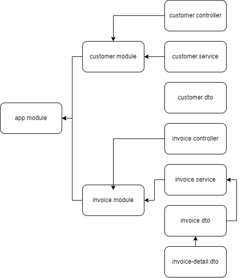

# Reto final de la segunda ruta del pathway de Nest
### por Edinson Acosta Gancharov

### Enlace a video explicativo: 

## Descripcion
El presente trabajo consiste en la creacion de una App con sus respectivos controladores, modulos y servicios basados en el siguiente esquema:

Para la solucion a este reto, por un lado se ha creado una entidad `Customer` que permite la creacion, manipulacion, busqueda y borrado de los datos de los clientes.

Por otro lado se ha creado otra entidad `Invoice`, que maneja todo lo referente a las facturas. Tambien se permite crear, modificar, buscar y borrar la informacion contenida.

Dentro de cada `invoice` se agregan los detalles correspondientes a las ventas, y cada factura esta asociada a un unico `Customer`.

## Acceder al proyecto
Para probar esta solucion se puede clonar este repositorio desde su IDE de preferencia o bien descargarlo en formato `.ZIP`, luego descomprimirlo y posteriormente asociarlo al IDE que prefiera.
Se recomienda usar Visual Studio Code.

## Iniciar el servicio
Una vez clonado o descargado el proyecto se puede ejecutar utilizando el comando `npm run start` desde la consola del IDE o del sistema.

## Pruebas
El test de funcionamiento del API se realiza mediante consumo de API a traves de POSTMAN, Thunder CLient, o cualquier otra API que permita realizar peticiones http.
Se adjunta en la carpeta `Assets`un archivo JSON con la configuracion de las peticiones HTTP para ser evaluadas en POSTMAN. Ese archivo debe ser importado desde la API para poder ser ejecutados los tests.

Para evaluar si el servicio esta funcionando puede, por ejemplo, ingresar a http://localhost:3000/customer y vera que recibe en pantalla el texto *"Root del servicio de Customers!"*
